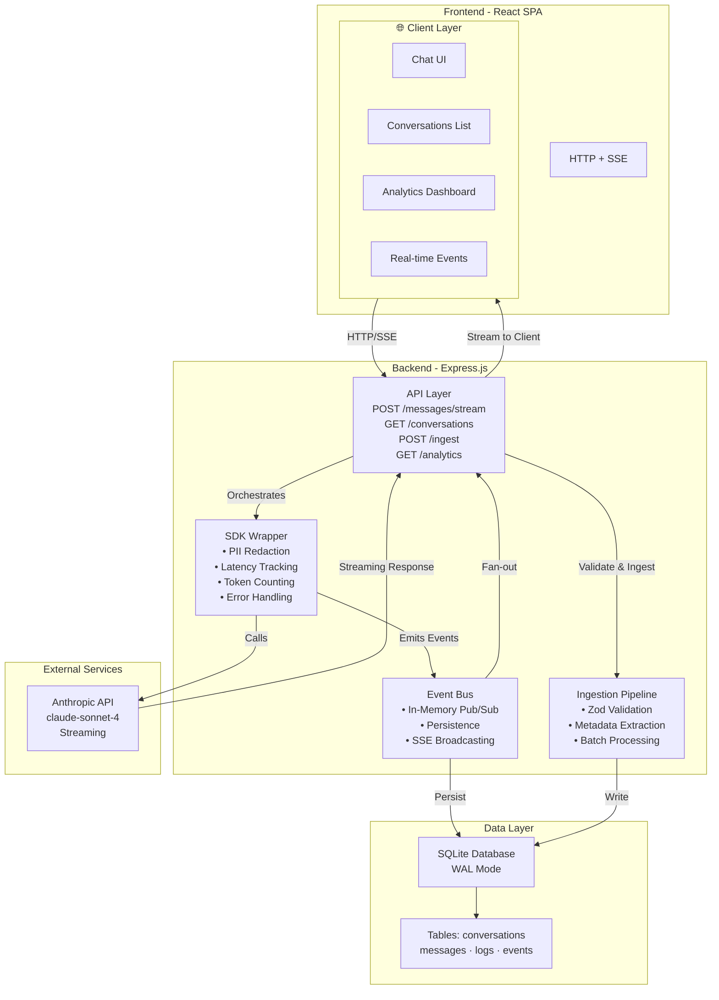
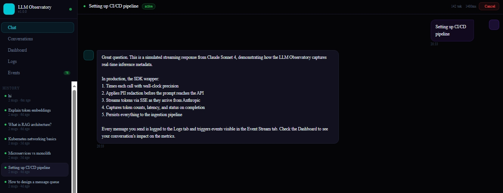
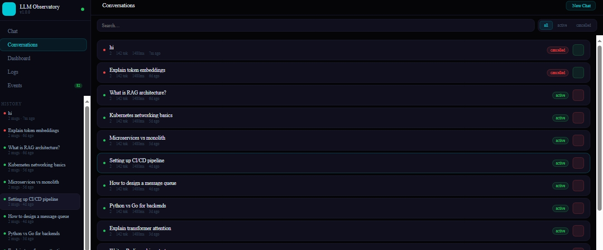
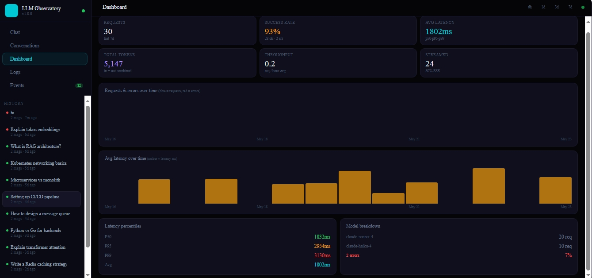
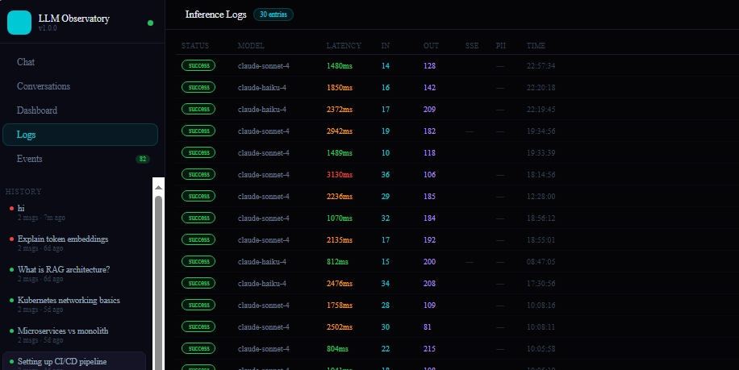
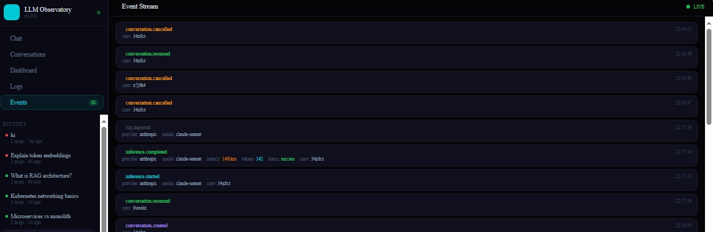

# 🔭 LLM Observatory

> A production-grade LLM inference logging, ingestion, and observability platform — with a multi-turn chatbot, real-time dashboards, streaming responses, PII redaction, and event-based architecture.

---

## ✨ Features

| Feature | Status |
|---|---|
| Multi-turn chatbot (Claude Sonnet 4) | ✅ |
| Streaming responses (SSE) | ✅ |
| Lightweight SDK wrapper | ✅ |
| Ingestion pipeline with validation | ✅ |
| SQLite storage with WAL mode | ✅ |
| Latency / Throughput / Error dashboards | ✅ |
| Real-time event stream (SSE) | ✅ |
| PII redaction (email, SSN, CC, phone…) | ✅ |
| Event-based architecture (in-memory bus + DB) | ✅ |
| Cancel / Resume / List conversations | ✅ |
| Docker Compose one-command setup | ✅ |
| Kubernetes manifests (self-hosted) | ✅ |
| Multi-provider ready architecture | ✅ |

---

## 🚀 Quick Start

### Option 1 — Docker Compose (recommended)

```bash
git clone https://github.com/Reethikaa05/ObservaLLM.git
cd ObservaLLM

# Set your Anthropic API key
cp .env.example .env
echo "ANTHROPIC_API_KEY=sk-ant-..." >> .env

# One command to run everything
docker compose up --build
```

- Frontend → http://localhost:5173  
- Backend API → http://localhost:3001  
- Health check → http://localhost:3001/health

### Option 2 — Local Dev

```bash
# Install all deps
npm run install:all

# Add your API key
cp backend/.env.example backend/.env
# Edit backend/.env and set ANTHROPIC_API_KEY

# Run both services in parallel
npm run dev
```

### Option 3 — Kubernetes (self-hosted)

```bash
# Build images
docker build -f docker/Dockerfile.backend -t observatory-backend:latest .
docker build -f docker/Dockerfile.frontend -t observatory-frontend:latest .

# Edit k8s/manifests.yaml and set your ANTHROPIC_API_KEY in the Secret

# Deploy
kubectl apply -f k8s/manifests.yaml

# Watch rollout
kubectl rollout status deployment/observatory-backend -n llm-observatory
```

---

## 🏗 Architecture Overview



**Architecture Highlights:**
- **Layered Design**: Clear separation between client, API, services, and data layers
- **Event-Driven**: Asynchronous event bus for real-time updates without blocking
- **Streaming First**: SSE for low-latency, connection-efficient real-time updates  
- **Observable**: Built-in PII redaction, latency tracking, and comprehensive logging
- **Scalable**: Event bus design allows horizontal scaling; SQLite WAL for concurrent reads/writes

---

## 📐 Schema Design Decisions

### `conversations`
Stores session-level aggregates (total tokens, total latency, message count) so dashboards don't need expensive JOINs for common queries. Status enum (`active` / `cancelled` / `completed`) enables conversation lifecycle management.

**Tradeoff**: Denormalized aggregates require UPDATE on every message, but this is a single-row write and far cheaper than a COUNT(*) at query time.

### `messages`
Full content stored alongside a `content_preview` (200 chars) to avoid loading full content for list views. Messages are ordered by `created_at` — insertion order is preserved by design.

### `inference_logs`
The core table. Captures the full SDK metadata per inference call: provider, model, latency, tokens, status, stream flag, PII flag, and input/output previews. The `raw_payload` JSON column gives an escape hatch for future schema evolution.

**Indexes** on `created_at`, `provider`, `status`, and `conversation_id` cover all analytics query patterns.

### `events`
Append-only event log for the event bus. Every domain event (`inference.completed`, `conversation.cancelled`, etc.) is persisted. Enables replay, audit, and future consumer patterns (e.g. Kafka migration).

**Tradeoff**: SQLite is single-writer. For high-concurrency writes, migration to PostgreSQL + WAL replication or a time-series DB (ClickHouse, TimescaleDB) would be the next step.

---

## 🔁 Ingestion Flow

```
Chat message sent
      │
      ▼
SDK.chatStream() called
      │
      ├──→ emit(INFERENCE_STARTED)
      │
      ├──→ PII redaction on user input
      │
      ├──→ Anthropic API (streaming)
      │         │
      │    yields chunks → SSE to browser
      │
      ├──→ emit(INFERENCE_COMPLETED) with full metadata
      │
      ▼
ingestLog(metadata)
      │
      ├──→ Zod validation
      ├──→ INSERT into inference_logs
      ├──→ UPDATE conversations aggregates
      └──→ emit(LOG_INGESTED) → SSE broadcast to all clients
```

---

## 📊 Logging Strategy

- **Near real-time**: SDK emits events synchronously after each call completes. No batching delay.
- **Dual path**: Events go to in-memory bus (for SSE) AND persisted to DB (for audit/replay).
- **PII-first**: Redaction happens before content leaves the backend (before LLM call), not after.
- **Preview truncation**: Input/output previews capped at 200 chars to keep log table lean.
- **Error capture**: Failed calls are fully logged with `error_code` and `error_message`.

---

## ⚡ Scaling Considerations

| Concern | Current approach | At scale |
|---|---|---|
| Database | SQLite + WAL (fast single-node) | PostgreSQL + read replicas |
| Event bus | In-memory pub/sub + SQLite | Kafka / Redis Streams |
| SSE fan-out | In-process Set of res objects | Redis Pub/Sub adapter |
| LLM providers | Anthropic SDK | Multi-provider router (OpenAI, Gemini, etc.) |
| Ingestion | Synchronous per-call | Async queue with dead-letter |
| Analytics | Ad-hoc SQL aggregation | Pre-aggregated rollups / materialized views |

---

## 🛡 Failure Handling

- **SDK errors**: All provider errors are caught, logged as `status: 'error'`, and emitted as events. The UI surfaces error state without crashing.
- **SSE disconnects**: Client Set auto-prunes dead connections. Clients auto-reconnect via `EventSource` browser API.
- **Ingestion failures**: Zod validation rejects malformed payloads with a 400. Batch ingestion continues on per-item errors, returning partial results.
- **DB errors**: All DB operations use try/catch. Write failures are logged to stderr but don't crash the process.
- **Missing API key**: Backend returns a clear 500 with message; the SDK surfaces it to the UI.

---

## 🔮 What I'd Improve With More Time

1. **PostgreSQL + Prisma** — Replace SQLite for multi-replica writes and proper connection pooling
2. **Kafka integration** — True event streaming with consumer groups, replay, and dead-letter queues
3. **Multi-provider router** — Unified interface for OpenAI, Gemini, Groq, DeepSeek with automatic failover
4. **Auth layer** — JWT-based user auth, conversation ownership, RBAC for log access
5. **Streaming token budget** — Real-time token counting during stream, cost estimation per request
6. **Alerting** — Webhook/email alerts when error rate > threshold or p99 latency spikes
7. **Log sampling** — Configurable sampling rates for high-volume production use
8. **Export** — CSV/JSON export of logs and analytics for data teams
9. **AI-powered titling** — Auto-generate conversation titles using a fast model
10. **Trace IDs** — Distributed tracing (OpenTelemetry) across SDK → ingestion → storage

---

## 📡 API Reference

### Conversations
| Method | Path | Description |
|---|---|---|
| GET | `/api/conversations` | List all conversations |
| POST | `/api/conversations` | Create new conversation |
| GET | `/api/conversations/:id` | Get conversation + messages |
| POST | `/api/conversations/:id/messages` | Send message (non-streaming) |
| POST | `/api/conversations/:id/messages/stream` | Send message (SSE streaming) |
| POST | `/api/conversations/:id/cancel` | Cancel conversation |
| POST | `/api/conversations/:id/resume` | Resume conversation |
| PATCH | `/api/conversations/:id` | Update title |

### Ingestion
| Method | Path | Description |
|---|---|---|
| POST | `/api/ingest` | Ingest single log |
| POST | `/api/ingest/batch` | Ingest batch of logs |
| GET | `/api/logs` | List inference logs |
| GET | `/api/analytics` | Dashboard analytics |
| GET | `/api/events` | List events |
| GET | `/api/events/stream` | SSE event stream |

---

## 🧱 Tech Stack

**Backend**: Node.js (ESM), Express, better-sqlite3, Zod, @anthropic-ai/sdk, nanoid  
**Frontend**: React 18, Vite, Tailwind CSS, Zustand, Recharts, React Router, Lucide  
**Infra**: Docker Compose, Nginx, Kubernetes  
**DB**: SQLite with WAL journal mode  

---

## 📸 Screenshots

The UI features:
- **Chat** — Streaming multi-turn chat with live token/latency display, cancel/resume per conversation
- **Conversations** — Searchable list with status filters, one-click cancel/resume
- **Dashboard** — Area charts (throughput/errors), latency percentiles (p50/p95/p99), provider breakdown
- **Logs** — Full inference log table with color-coded latency and status
- **Events** — Real-time SSE event feed showing every bus event as it happens

### Chat UI

*Streaming conversation with live token count and latency metrics.*

### Conversations Management

*Filter, search, and manage multiple conversations.*

### Analytics Dashboard

*Visual analytics showing throughput, latency percentiles, and provider breakdown.*

### Inference Logs

*Detailed inference log table with color-coded latency and status indicators.*

### Real-time Events

*Real-time SSE event feed showing every bus event as it happens.*

---

## 📁 Project Structure

```
llm-observatory/
├── backend/                          # Express.js backend API
│   ├── src/
│   │   ├── index.js                 # Server entry point
│   │   ├── api/                     # API route handlers
│   │   │   ├── conversations.js     # Conversation endpoints
│   │   │   └── ingestion.js         # Log ingestion endpoints
│   │   ├── db/
│   │   │   └── migrate.js           # SQLite schema & migrations
│   │   ├── events/
│   │   │   └── bus.js               # Event bus (pub/sub)
│   │   ├── sdk/
│   │   │   └── llm.js               # LLM SDK wrapper
│   │   ├── services/                # Business logic
│   │   │   ├── conversations.js     # Conversation operations
│   │   │   ├── ingestion.js         # Log ingestion logic
│   │   │   └── pii.js               # PII redaction service
│   │   └── middleware/              # Express middleware
│   ├── package.json
│   └── .env.example
│
├── frontend/                         # React Vite frontend
│   ├── src/
│   │   ├── main.jsx                 # App entry point
│   │   ├── App.jsx                  # Root component
│   │   ├── components/              # Reusable components
│   │   │   └── Sidebar.jsx         # Navigation sidebar
│   │   ├── pages/                   # Page components
│   │   │   ├── ChatPage.jsx
│   │   │   ├── ConversationsPage.jsx
│   │   │   ├── DashboardPage.jsx
│   │   │   ├── EventsPage.jsx
│   │   │   └── LogsPage.jsx
│   │   ├── hooks/                   # Custom React hooks
│   │   │   └── useSSE.js            # Server-Sent Events hook
│   │   ├── lib/
│   │   │   └── api.js               # API client functions
│   │   ├── stores/
│   │   │   └── store.js             # Zustand state management
│   │   └── index.css                # Global styles
│   ├── vite.config.js
│   ├── tailwind.config.js
│   ├── postcss.config.js
│   ├── package.json
│   └── index.html
│
├── docker/                          # Docker configuration
│   ├── Dockerfile.backend           # Backend container image
│   ├── Dockerfile.frontend          # Frontend container image
│   └── nginx.conf                   # Nginx reverse proxy config
│
├── k8s/                             # Kubernetes deployment
│   └── manifests.yaml               # K8s StatefulSet, Service, ConfigMap
│
├── docker-compose.yml               # Multi-container orchestration
├── package.json                     # Root workspace configuration
├── README.md                        # This file
└── Screenshot/                      # UI screenshots for documentation
    ├── Screenshot_23-5-2026_23339_.jpeg
    ├── Screenshot_23-5-2026_23415_.jpeg
    ├── Screenshot_23-5-2026_23437_.jpeg
    ├── Screenshot_23-5-2026_23459_.jpeg
    └── Screenshot_23-5-2026_23520_.jpeg
```

---

## 🔧 Development

### Install Dependencies
```bash
npm run install:all  # Installs both backend and frontend deps
```

### Start Development Server
```bash
npm run dev  # Runs both backend and frontend in watch mode
```

### Build for Production
```bash
npm run build:all  # Build backend and frontend
```

### Database Migrations
```bash
node backend/src/db/migrate.js  # Initialize SQLite schema
```

---

## 📄 License

MIT — Feel free to use this project for learning, inspiration, or production deployment.
